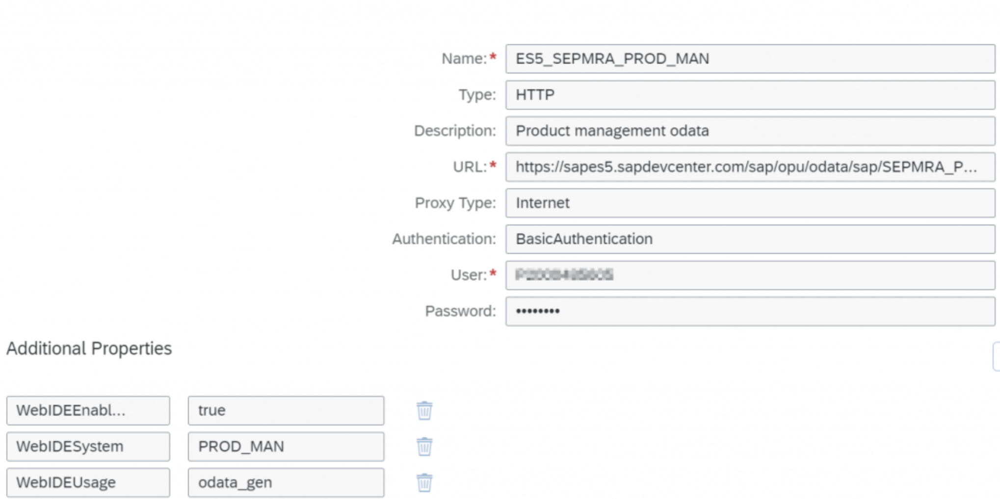
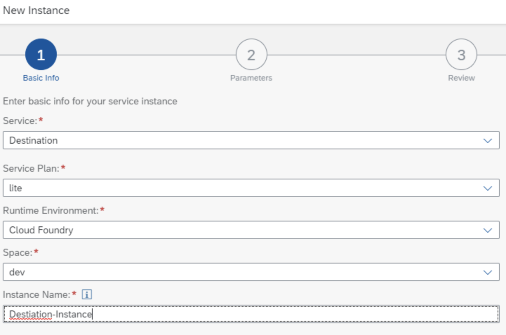
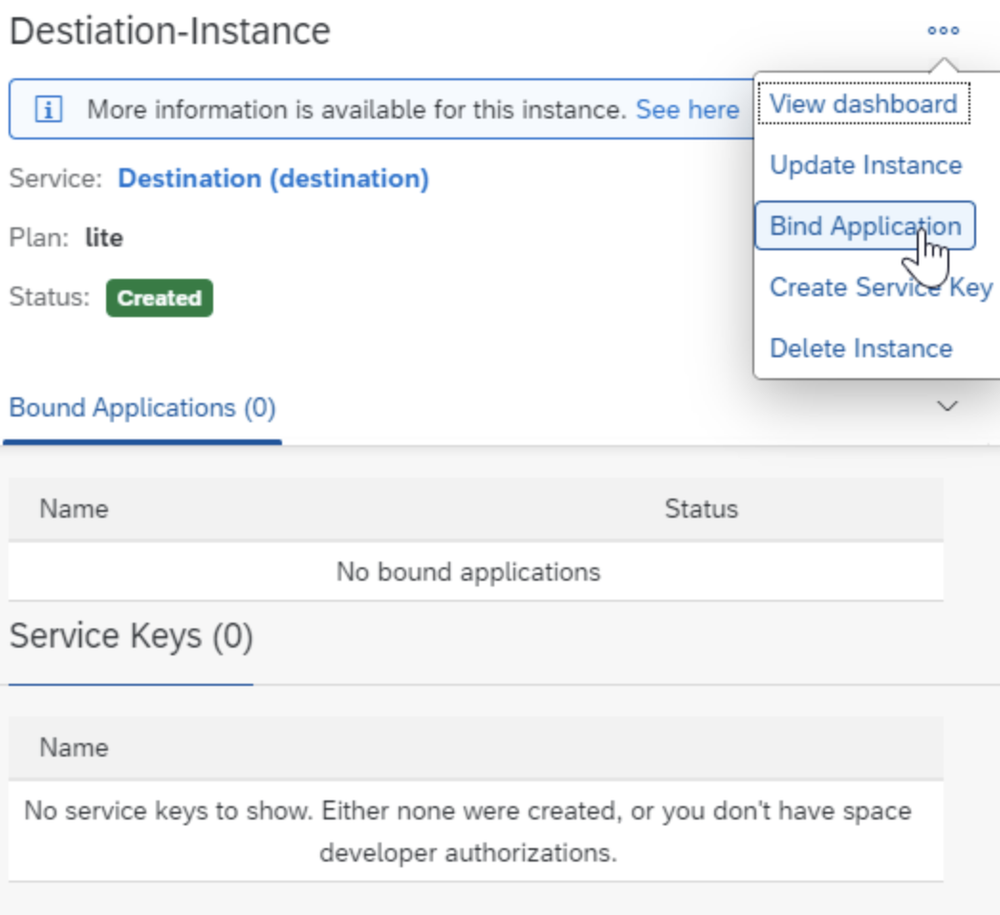
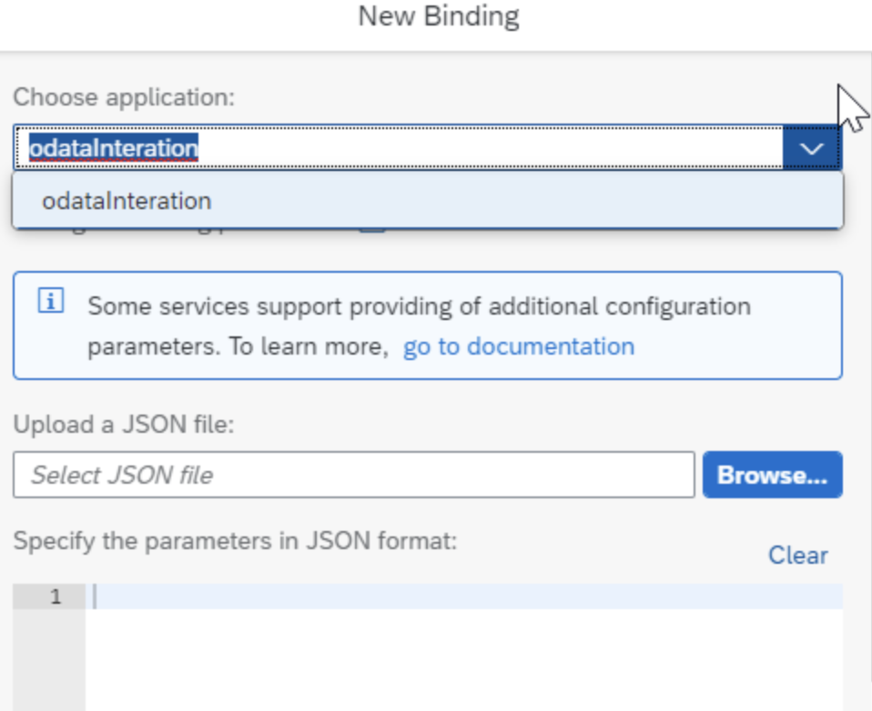
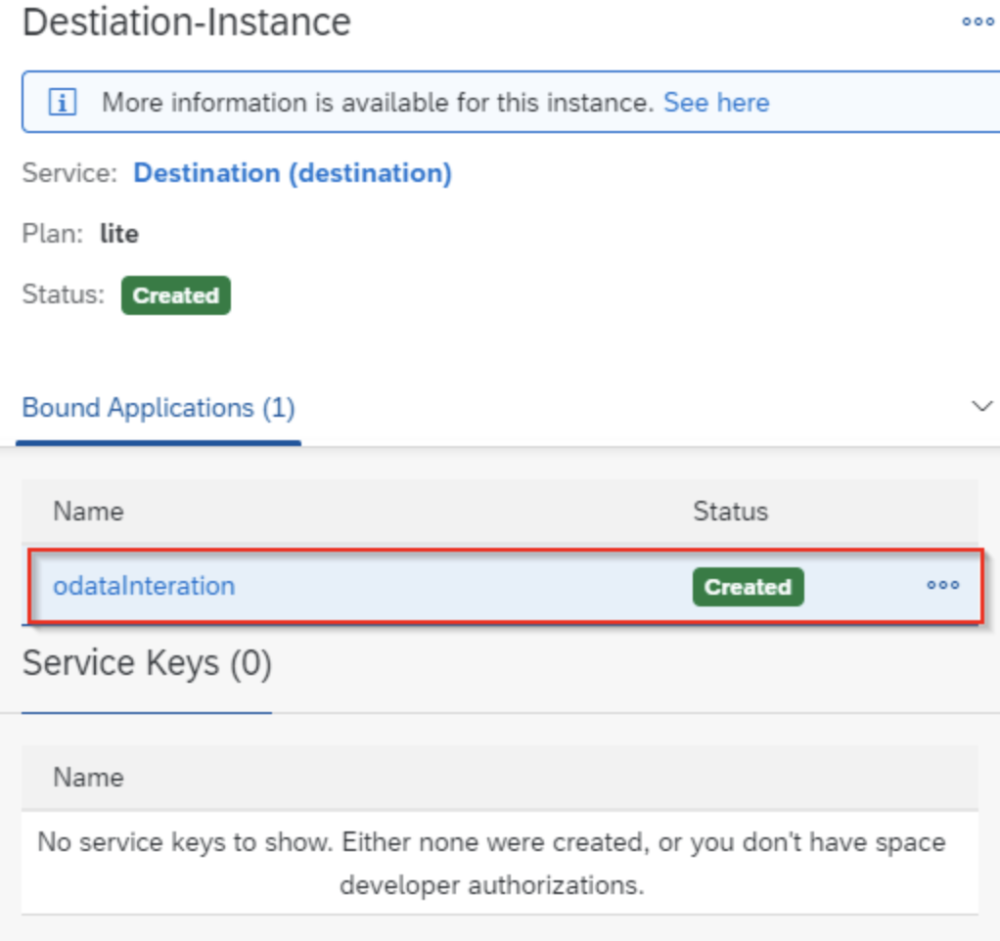
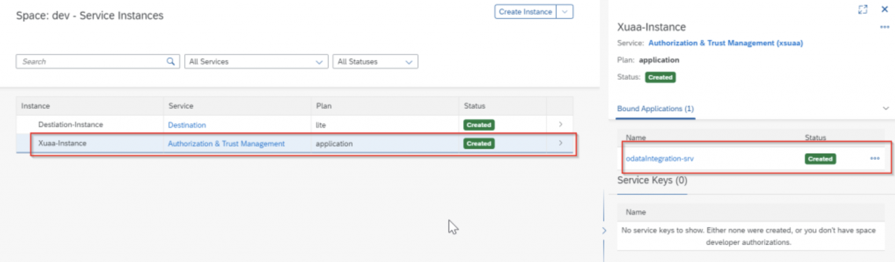
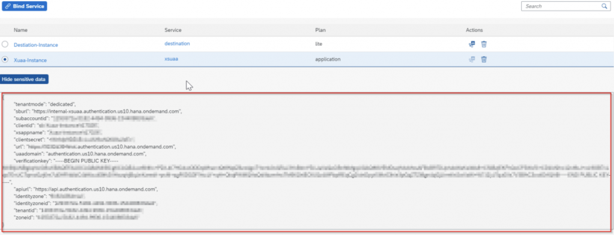
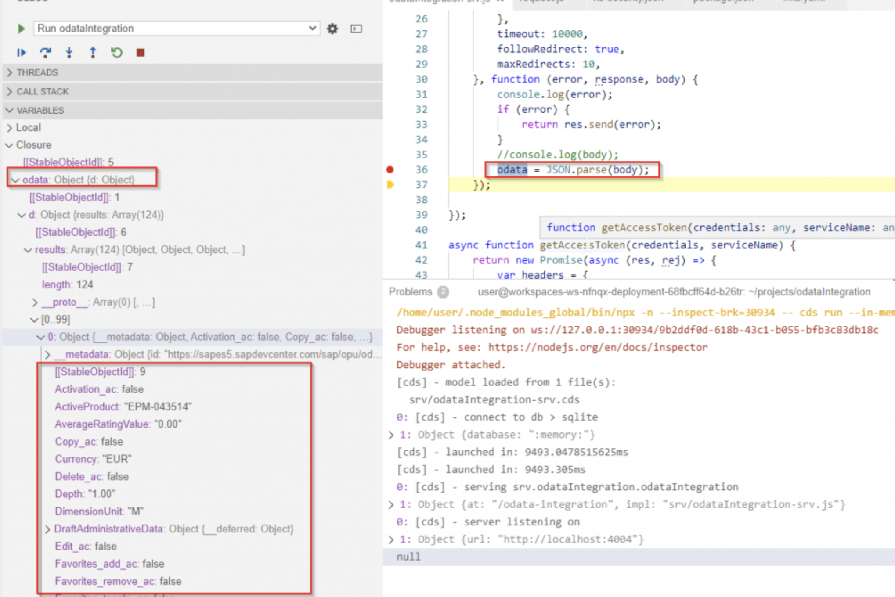

Hoy integraremos la llamada a un oData en nuestra aplicación CAP.

Antes que nada debéis crearos un usuario en el Gateway Demo de SAP, pulsa aquí para saber cómo.

Para ello lo primero es crear la destination en nuestra Subcuenta.


Luego crearemos un servicio que nos habilitará poder acceder a la destination y en consecuencia, al oData:


Creamos una nueva carpeta llamada odataIntegration
```shell
cds init odataIntegration
npm install -g
```

Creamos en la carpeta /srv llamado odataIntegration-srv.cds
```cds
namespace srv.odataIntegration;
service odataIntegration {}
```

Lo dejamos vacío ya que sólo vamos a implementar la llamada al odata de productos. Creamos ahora el archivo .js con el mismos nombre (odataIntegratin-srv.js)
```js
const cds = require('@sap/cds');
module.exports = cds.service.impl(async function () {
})
```

Vamos a deployar usando MTA:
```shell
npm install -g mbt
cds add mta
mbt build
```

Con el comando mbt build  se nos generará una nueva carpeta mta_module donde se encuentra nuestro archivo a deployar .mtar
```shell
cf deploy odataIntegration_1.0.0.mtar
```

Ahora enlazamos nuestra aplicación a la instancia de servicio que hemos creado al principio (destination).

Podemos hacerlo mediante el comando
```shell
cf bind-service odataIntegration-srv Destiation-Instance
```

O a mano accediendo a service instances y enlazando nuestra aplicación de la siguiente manera:




Una vez vinculadas las aplicaciones modificaremos nuestro package.json para importar las librerías necesarias ejecutando los siguientes comandos, de esta manera se añadirán a las dependencias automáticamente:
```shell
npm install @sap/xsenv
npm install @sap/xssec
npm install passport
npm install express
```

```json
{
  "name": "odataIntegration",
  "version": "1.0.0",
  "description": "A simple CAP project.",
  "repository": "<Add your repository here>",
  "license": "UNLICENSED",
  "private": true,
  "dependencies": {
    "@sap/cds": "^4",
    "@sap/xsenv": "^3.1.0",
    "@sap/xssec": "^3.0.10",
    "express": "^4.17.1",
    "passport": "^0.4.1"
  },
  "devDependencies": {
    "sqlite3": "^5"
  },
  "scripts": {
    "start": "npx cds run"
  }
}
```

```shell
cds compile srv/ --to xsuaa > xs-security.json
```

Al ejecutar el comando cds compile srv/ –to xsuaa > xs-security.json estaremos generando un archivo para nuestra instancia xuaa, en este archivo podremos generar los roles de nuestra aplicación para posteriormente asignarlos a los usuarios.

Modificaremos a mano el archivo package.json para añadir

```json
"cds": {
  "uaa": {
        "kind": "xsuaa"
      }
}
```

De manera que nuestro archivo package.json debe quedar de la siguiente manera:

```json
{
  "name": "odataIntegration",
  "version": "1.0.0",
  "description": "A simple CAP project.",
  "repository": "<Add your repository here>",
  "license": "UNLICENSED",
  "private": true,
  "dependencies": {
    "@sap/cds": "^4",
    "@sap/xsenv": "^3.1.0",
    "@sap/xssec": "^3.0.10",
    "express": "^4.17.1",
    "passport": "^0.4.1"
  },
  "devDependencies": {
    "sqlite3": "^5"
  },
  "scripts": {
    "start": "npx cds run"
  },
  "cds": {
      "uaa": {
        "kind": "xsuaa"
      }
  }
}
```

Ahora vamos a añadir los servicios al archivo mta.yaml  de tal manera que debería quedar así

```yaml
## Generated mta.yaml based on template version 0.4.0
## appName = odataIntegration
## language=nodejs; multiTenant=false
## approuter=
_schema-version: '3.1'
ID: odataIntegration
version: 1.0.0
description: "A simple CAP project."
parameters:
  enable-parallel-deployments: true
   
build-parameters:
  before-all:
   - builder: custom
     commands:
      - npm install --production
      - npx -p @sap/cds-dk cds build --production

modules:
 # --------------------- SERVER MODULE ------------------------
 - name: odataIntegration-srv
 # ------------------------------------------------------------
   type: nodejs
   path: gen/srv
   requires:
    - name: Xuaa-Instance
    - name: Destiation-Instance
   provides:
    - name: srv-api      # required by consumers of CAP services (e.g. approuter)
      properties:
        srv-url: ${default-url}
        
resources:
# ------------------------------------------------------------
 - name: Xuaa-Instance
# ------------------------------------------------------------
   type: org.cloudfoundry.managed-service
   parameters:
     path: ./xs-security.json 
     service: xsuaa
     service-plan: application  
     config:
       xsappname: Xuaa-Instance   
       tenant-mode: dedicated
       
# ------------------------------------------------------------
 - name: Destiation-Instance
# ------------------------------------------------------------
   type: org.cloudfoundry.managed-service
   
   parameters:
     service: destination
     service-plan: lite  
     config:
       service-name: Destiation-Instance
```

Vamos a volver a desplegar la aplicación con esta configuración

```shell
mbt build
cf deploy mta_archives/odataIntegration_1.0.0.mtar
```

Si vamos al apartado de service instances de nuestra subcuenta veremos que se ha creado una instancia del servicio XSUAA, en el caso de haber tenido roles, también nos los habría creado y estarían listos para asignar.


Ahora vamos a implementar el código que llama al oData, abrimos el archivo odataIntegration-srv.js

```js
const cds = require('@sap/cds');
const qs = require('qs');
const axios = require('axios');
const request = require('request');
const xsenv = require('@sap/xsenv');
const jar = request.jar();
const xsuaa = xsenv.getServices({ xsuaa: { name: 'Xuaa-Instance' } }).xsuaa;
const destination = xsenv.getServices({ destination: { name: 'Destiation-Instance' } }).destination;
const destinationSecret = destination.clientid + ':' + destination.clientsecret;
const destinationCredentials = Buffer.from(destinationSecret).toString('base64');
const express = require("express");
const app = express();

module.exports = cds.service.impl(async function () {
    let destinationToken = await getAccessToken(destinationCredentials, destination);
    let url = await _getDestinationURL(destinationToken);

    let odata = await request({
        uri: url.url + 'SEPMRA_C_PD_Product',
        method: "GET",
        jar: jar,
        headers: {
            'Accept': 'application/json',
            'Authorization': url.auth,
        },
        timeout: 10000,
        followRedirect: true,
        maxRedirects: 10,
    }, function (error, response, body) {
        console.log(error);
        if (error) {
            return res.send(error);
        }
        //console.log(body);
        let json = JSON.parse(body);
    });

});

async function getAccessToken(credentials, serviceName) {
    return new Promise(async (res, rej) => {
        var headers = {
            'Authorization': 'Basic ' + credentials,
            'content-type': 'application/x-www-form-urlencoded'
        }
        var form = {
            'client_id': serviceName.clientid,
            'grant_type': 'client_credentials'
        }
        let response = await axios({
            method: 'post',
            url: xsuaa.url + '/oauth/token',
            data: qs.stringify(form),
            headers: headers
        });
        let token = response.data.access_token;
        res(token)
    })
};

async function _getDestinationURL(token) {
    return new Promise(async (res, rej) => {
        var headers = { 'Authorization': 'Bearer ' + token };
        let response = await axios({
            method: 'get',
            url: destination.uri + '/destination-configuration/v1/subaccountDestinations/' + 'ES5_SEPMRA_PROD_MAN',
            headers: headers
        });
        var tokenAuth = response.data.User + ':' + response.data.Password;

        var auth = 'Basic ' + Buffer.from(tokenAuth).toString('base64');

        res({ url: response.data.URL, auth: auth });
    })
};
```

Para probar la aplicación localmente debemos crear el archivo default-env.json con el siguiente contenido:

```json
{
    "VCAP_SERVICES": {
        "xsuaa": [
            {
                "name": "Xuaa-Instance",
                "label": "xsuaa",
                "tags": [
                    "xsuaa"
                ],
                "credentials": {
            ...
                }
            }
        ],
        "destination": [
            {
                "name": "Destiation-Instance",
                "label": "destination",
                "tags": [
                    "destination"
                ],
                "credentials": {
                  ...
                }
            }
        ]
    }
}
```

Tanto en la sección credential de xsuaa como de destination debemos copiar las variables de entorno. Para ello vamos a la aplicación desplegada y en Service Bindings pulsamos en Show sensitive data y copiamos todo el contenido.


Ya estamos listos para ejecutar la aplicación en modo test, sólo un paso más!!


Nos llevará al archivo launch.json
```json
{
  // Use IntelliSense to learn about possible attributes.
  // Hover to view descriptions of existing attributes.
  "version": "0.2.0",
  "configurations": [
      
    {
      "name": "Run odataIntegration",
      "request": "launch",
      "type": "node",
      "cwd": "/home/user/projects/odataIntegration",
      "runtimeExecutable": "npx",
      "runtimeArgs": [
        "-n"
      ],
      "args": [
        "--",
        "cds",
        "run",
        "--in-memory?"
      ],
      "console": "internalConsole",
      "internalConsoleOptions": "openOnSessionStart",
      "skipFiles": [
        "<node_internals>/**"
      ],
      "env": {
        "run.config": "{\"handlerId\":\"cap_run_config_handler_id\",\"runnableId\":\"/home/user/projects/Henkel-DANUBE-AssetREQ\"}"
      }
    }
  ]
}
```

Con esto ponemos un breakpoint en al final del código, donde recuperamos el valor del body y lo asignamos a odata veremos que tendremos un objeto JSON con el resultado de la llamada.


Para configurar una llamada post, antes de hacer la llamda debemos obtener el CSRF-Token, para ello añadimos al final del código la siguiente función. Después añadimos la llamada a esta función y el POST, de tal manera que nuestro archivo odataIntegration-srv.js debe quedar así:
```js
const cds = require('@sap/cds');
const qs = require('qs');
const axios = require('axios');
const request = require('request');
const xsenv = require('@sap/xsenv');
const jar = request.jar();
const xsuaa = xsenv.getServices({ xsuaa: { name: 'Xuaa-Instance' } }).xsuaa;
const destination = xsenv.getServices({ destination: { name: 'Destiation-Instance' } }).destination;
const destinationSecret = destination.clientid + ':' + destination.clientsecret;
const destinationCredentials = Buffer.from(destinationSecret).toString('base64');
const express = require("express");
const app = express();

module.exports = cds.service.impl(async function () {
    let destinationToken = await getAccessToken(destinationCredentials, destination);
    let url = await _getDestinationURL(destinationToken);
    let odata;
    let res = await request({
        uri: url.url + 'SEPMRA_C_PD_Product',
        method: "GET",
        jar: jar,
        headers: {
            'Accept': 'application/json',
            'Authorization': url.auth,
        },
        timeout: 10000,
        followRedirect: true,
        maxRedirects: 10,
    }, function (error, response, body) {
        console.log(error);
        if (error) {
            return res.send(error);
        }
        //console.log(body);
        odata = JSON.parse(body);
    });

let CSRFToken = await getCSRFToken(url.url, url.auth);

oData = {
      "Activation_ac":false,
      "Copy_ac":true,
      "Delete_ac":true,
      "Edit_ac":true,
      "Favorites_add_ac":true,
      "Favorites_remove_ac":true,
      "Favorites_toggle_ac":true,
      "Mycart_add_ac":true,
      "Preparation_ac":false,
      "Review_delete_ac":true,
      "Review_modify_ac":true,
      "Validation_ac":false,
      "Product_fc":7,
      "ProductDraftUUID":"00000000-0000-0000-0000-000000000000",
      "DimensionUnit":"M",
      "ProductPictureURL":"/sap/public/bc/NWDEMO_MODEL/IMAGES/no_photo.jpg",
      "Supplier":"100000032",
      "ProductBaseUnit":"EA",
      "Weight":"1.000",
      "WeightUnit":"KG",
      "OriginalLanguage":"EN",
      "AverageRatingValue":"0.00",
      "Name":"test",
      "IsActiveEntity":true,
      "ActiveProduct":"EPM-043514",
      "HasActiveEntity":false,
      "HasDraftEntity":false,
      "Product":"EPM-043514",
      "ProductCategory":"Computer System Accessories",
      "Price":"1.00",
      "Currency":"EUR",
      "Height":"1.00",
      "Width":"1.00",
      "Depth":"1.00"
}

    let resPost = await request({
        uri: url.url + "SEPMRA_C_PD_Product",
        method: "POST",
        jar: jar,
        headers: {
            'content-type': 'application/json',
            'Accept': 'application/json',
            'Authorization': url.auth,
            'X-CSRF-token': CSRFToken,
        },
        body: JSON.stringify(oData),
        timeout: 10000,
        followRedirect: true,
        maxRedirects: 10,
    }, function (error, response, body) {
        console.log(error);
        if (error) {
            return res.send(error);
        }
        console.log(body);
        let json = JSON.parse(body);
    });

});

async function getAccessToken(credentials, serviceName) {
    return new Promise(async (res, rej) => {
        var headers = {
            'Authorization': 'Basic ' + credentials,
            'content-type': 'application/x-www-form-urlencoded'
        }
        var form = {
            'client_id': serviceName.clientid,
            'grant_type': 'client_credentials'
        }
        let response = await axios({
            method: 'post',
            url: xsuaa.url + '/oauth/token',
            data: qs.stringify(form),
            headers: headers
        });
        let token = response.data.access_token;
        res(token)
    })
};

async function _getDestinationURL(token) {
    return new Promise(async (res, rej) => {
        var headers = { 'Authorization': 'Bearer ' + token };
        let response = await axios({
            method: 'get',
            url: destination.uri + '/destination-configuration/v1/subaccountDestinations/' + 'ES5_SEPMRA_PROD_MAN',
            headers: headers
        });
        var tokenAuth = response.data.User + ':' + response.data.Password;

        var auth = 'Basic ' + Buffer.from(tokenAuth).toString('base64');

        res({ url: response.data.URL, auth: auth });
    })
};

async function getCSRFToken(url, auth) {
    return new Promise(async (res, rej) => {
        request({
            uri: url,
            method: "GET",
            jar: jar,
            headers: {
                'X-CSRF-token': 'Fetch',
                'Authorization': auth,
            },
            timeout: 10000,
            followRedirect: true,
            maxRedirects: 10,
        }, function (error, response, body) {
            if (error) {
                rej(error);
            }
            res(response.headers['x-csrf-token']);
        });
    })
};
```

```
⚠️ IMPORTANTE, he subido el proyecto a git pero debéis tener en cuenta que los datos en la sección credentials debéis copiarlos de las service instances xsuaa y destination para que os funcione.
https://github.com/saradasilva/sapworkbench-CAP-odataIntegration
```


