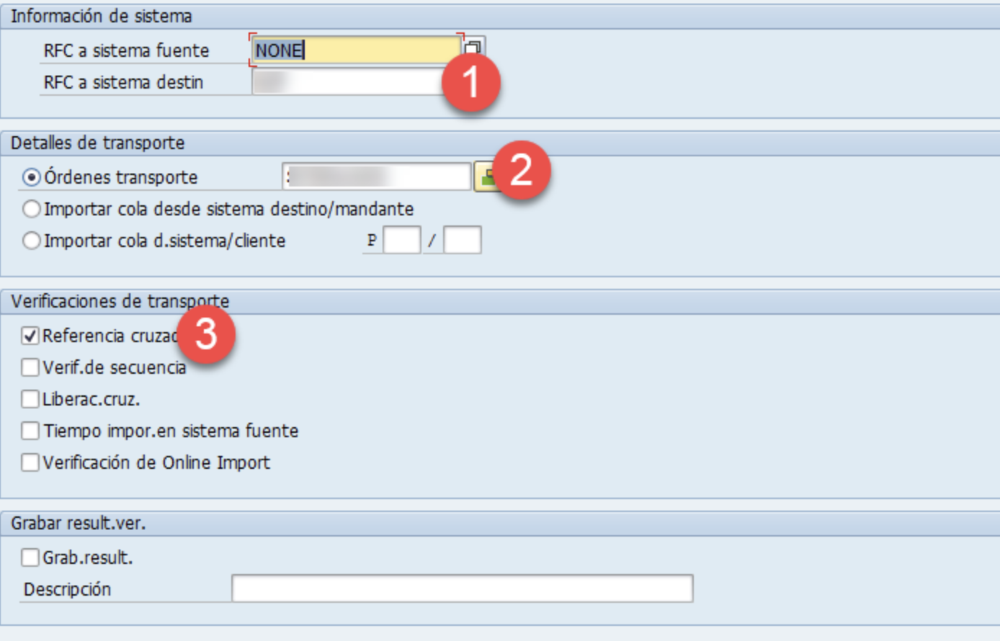
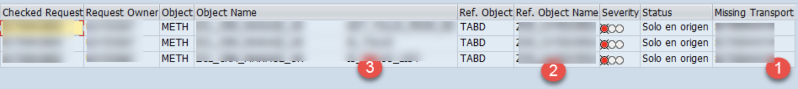

Aquí os traigo cómo simular imports en producción ¿cuántas veces no os habéis encontrado con errores de compilación cuando habéis transportado a un sistema productivo?

* Transacción: /SDF/TRCHECK


1. Introducimos el sistema destino (RFC que apunta hacia donde queremos importar la orden)
2. Órdenes de transporte, podemos introducir una o varias, esto quiere decir que si tenemos los objetos en varias órdenes (metidas en CHARMs por ejemplo) podemos validar el import tal y como se transportaría al sistema destino.
3. Marcamos Referencia cruzada.


1. La última orden que se liberó con el objeto en error.
2. El objeto que no está/ falla en el sistema destino y por lo que dará error la orden.
4. Los objetos que están dentro de mi orden y utilizan el objeto que da error (punto 2)

```
Como idea, este programa se puede ejecutar con un submit y obtener los mensajes para pintarlos antes de liberar una orden.
```
