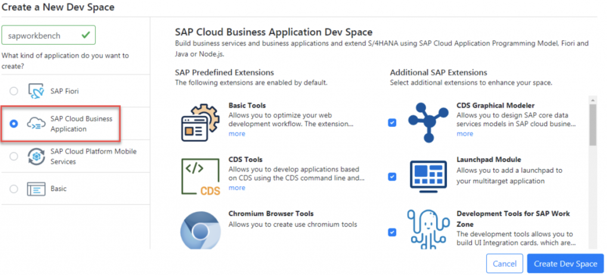
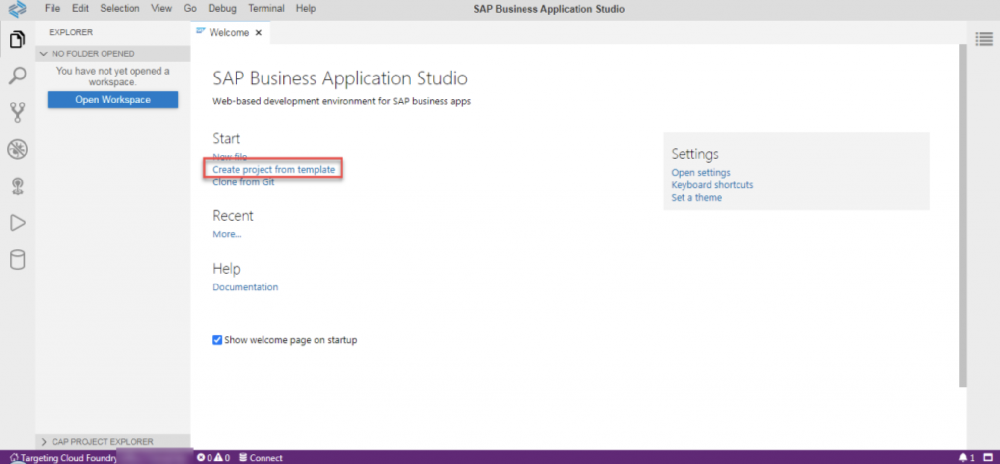
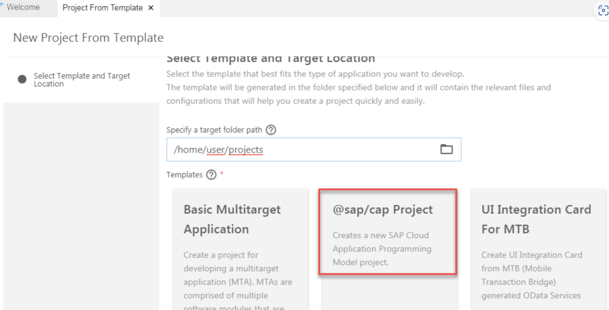
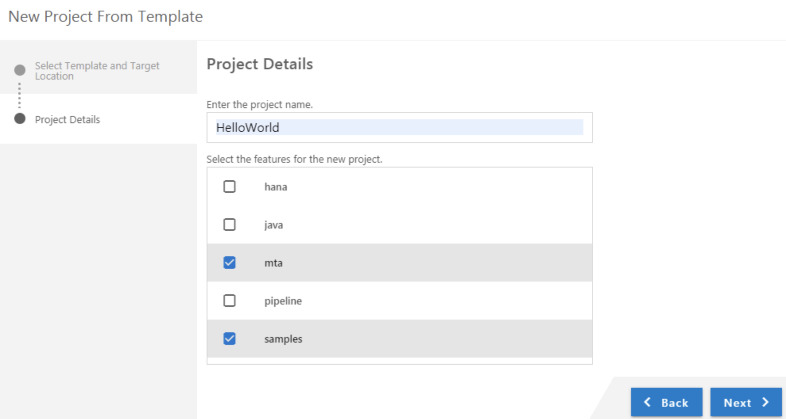
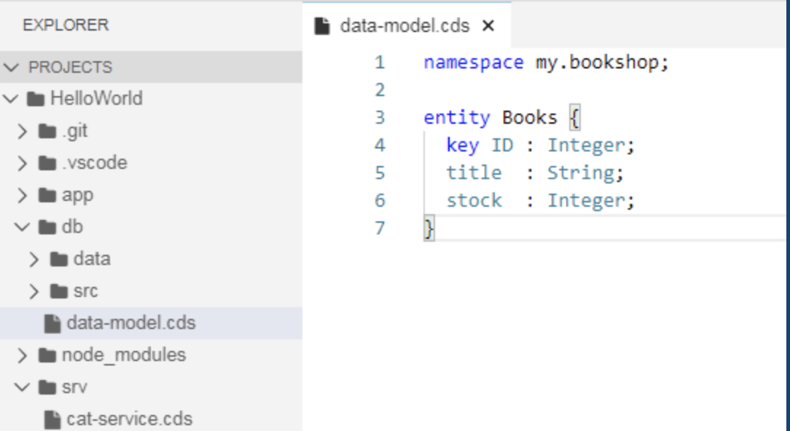
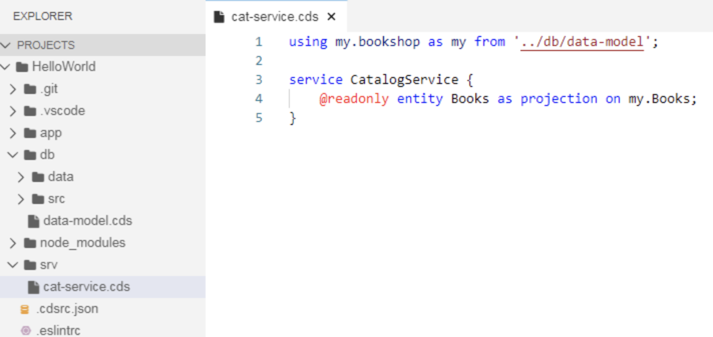
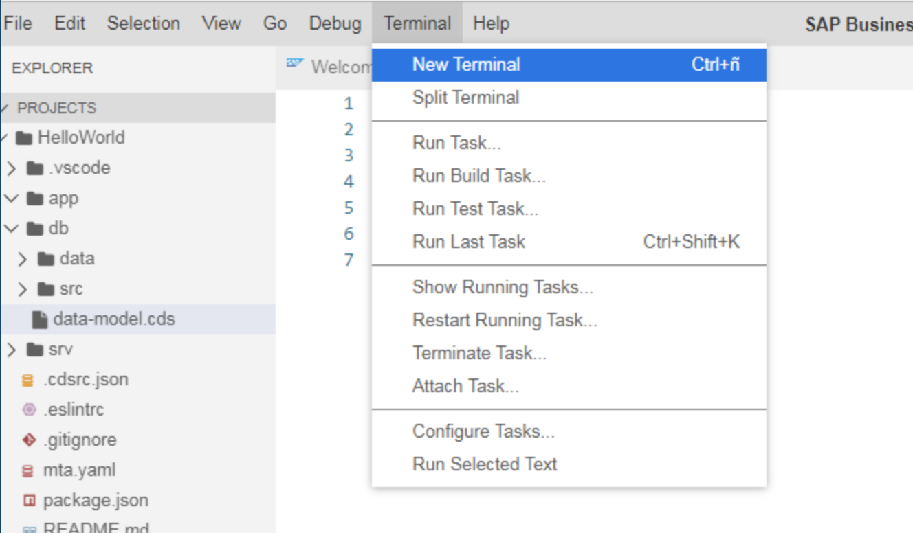
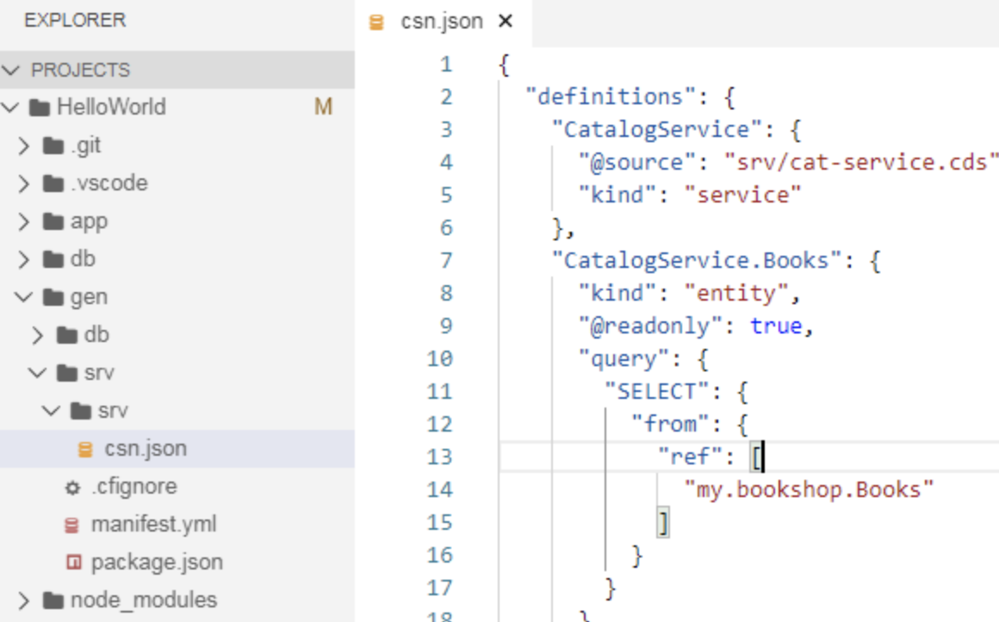

# Crear un servicio Hello World

Crearemos esta aplicación usando Business Application Studio de Cloud Foundry. El modelo de programación proporciona un template y un proyecto de ejemplo, que usaremos para crear un servicio OData. Sigue los siguientes pasos:
1. Abre el Business Application Studio. Crea un proyecto de tipo SAP Cloud Business Application:


2. En la siguiente pantalla seleccionamos Create from template.


3. Seleccionamos el directorio de nuestro proyecto y @SAP/CAP Project


4. Nombramos nuestro proyecto y marcamos los flags mta y sample.


5. Como se ve en la imagen, se han creado los archivos y carpetas para el proyecto. Por defecto, el sistema creará modelos de datos y servicios para una entidad estándar. Click en data-model.cds para visualizar el modelo de datos en este archivo. Verás una entidad: Books. Estas entidades se especifican usando CDS (Core Data Services), y una vez construido el proyecto, cada entidad crea una tabla en base de datos.


6. Abre el archivo cat-service.cds para ver su definición de servicio. La entidad crea la definición del servicio, que se convertirá en el servicio OData para la entidad.


7. Abre un terminal:


8. Ejecutamos los siguientes comandos
```shell
cd HelloWorld "[Opcional] Si estamos en una carpeta superior
cds build
cds deploy --to sqlite "para crear la base de datos sqlite
```

```
Sap Cloud Programming Model proporciona un enfoque agnóstico de base de datos para crear modelos de datos. Cuando construimos el proyecto, el framework identifica la base de datos subyacente de la configuración y crea la correspondiente base de datos.
```

9. Si entramos en la carpeta gen/srv veremos el servicio OData que hemos implementado.


```shell
cds watch
```

Se abrirá la aplicación y veremos el metadata de nuestro servicio:
```xml
<edmx:Edmx xmlns:edmx="http://docs.oasis-open.org/odata/ns/edmx" Version="4.0">
<edmx:Reference Uri="https://oasis-tcs.github.io/odata-vocabularies/vocabularies/Org.OData.Capabilities.V1.xml">
<edmx:Include Alias="Capabilities" Namespace="Org.OData.Capabilities.V1"/>
</edmx:Reference>
<edmx:DataServices>
<Schema xmlns="http://docs.oasis-open.org/odata/ns/edm" Namespace="CatalogService">
<EntityContainer Name="EntityContainer">
<EntitySet Name="Books" EntityType="CatalogService.Books"/>
</EntityContainer>
<EntityType Name="Books">
<Key>
<PropertyRef Name="ID"/>
</Key>
<Property Name="ID" Type="Edm.Int32" Nullable="false"/>
<Property Name="title" Type="Edm.String"/>
<Property Name="stock" Type="Edm.Int32"/>
</EntityType>
<Annotations Target="CatalogService.EntityContainer/Books">
<Annotation Term="Capabilities.DeleteRestrictions">
<Record Type="Capabilities.DeleteRestrictionsType">
<PropertyValue Property="Deletable" Bool="false"/>
</Record>
</Annotation>
<Annotation Term="Capabilities.InsertRestrictions">
<Record Type="Capabilities.InsertRestrictionsType">
<PropertyValue Property="Insertable" Bool="false"/>
</Record>
</Annotation>
<Annotation Term="Capabilities.UpdateRestrictions">
<Record Type="Capabilities.UpdateRestrictionsType">
<PropertyValue Property="Updatable" Bool="false"/>
</Record>
</Annotation>
</Annotations>
</Schema>
</edmx:DataServices>
</edmx:Edmx>
```
Y si entramos en la entidad Books obtendremos la información de template generada en el CSV dentro de db/data.

```json
{
"@odata.context": "$metadata#Books",
"value": [
{
"ID": 1,
"title": "Wuthering Heights",
"stock": 100
},
{
"ID": 2,
"title": "Jane Eyre",
"stock": 500
}
]
}
```

https://github.com/saradasilva/sapworkbench-CAP-HelloWorld


