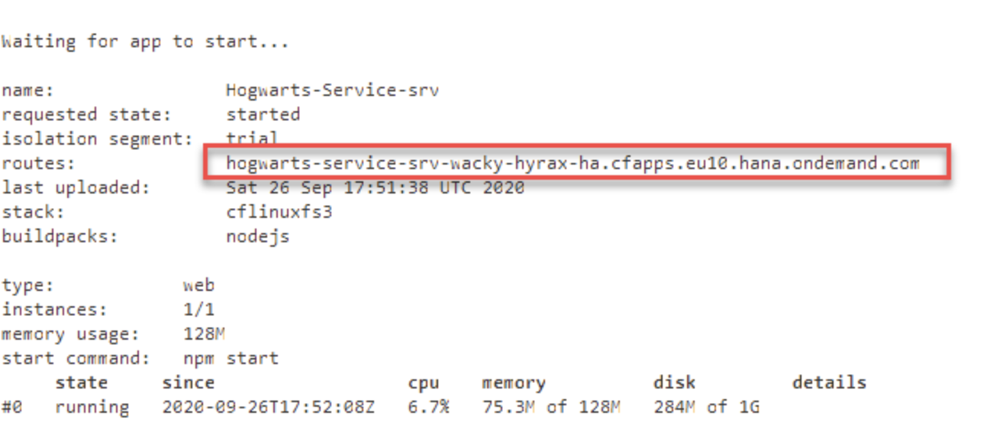

Por favor lee esta entrada antes de crear el proyecto y asegúrate de tener todos los conceptos claros antes de seguir

MODELO DE DATOS
Entramos en el Business Application Studio y ejecutamos:
```shell
cds init Hogwarts-Service
```

Con esto crearemos toda la estructura del proyecto dentro de la carpeta Hogwarts-Service recomendada por CAP:

* app: esta carpeta contendrá todas las apps UI.
* db: esta carpeta contendrá todo el contenido relacionado con base de datos.
* srv: esta carpeta contendrá la implementación del servicio.
* packaje.json: Este archivo es el descriptor del proyecto y contiene los metadatos del proyecto, por ejemplo, la versión del proyecto, dependencias, etc.

Nos posicionamos dentro del directorio que acabamos de crear:
```shell
cd Hogwarts-Service
```

Abre el archivo package.json y presta atención al metadata del proyecto, especialmente a la linea que empieza por @sap/cds. Esta línea indica que nuestro proyecto depende de @sap/cds.
```shell
npm install
```

Ejecutamos el comando npm install para instalar todos los módulos listados como dependencias en el packaje.js. Las dependencias se instalarán en la carpeta node_modules.


Ahora vamos a crear el modelo de datos para las posiciones en el fichero .cds.

Para hacer la aplicación escalable, primero vamos a crear la entidad Producto. La entidad Producto es una entidad genérica y podemos reusarla, no solo para las pociones, sino que también para otro tipo de productos.

ENTIDAD PRODUCTOS
```json
namespace db.HogwartsService;

using {
    cuid,
    managed
} from '@sap/cds/common';

type Puntuacion : Integer enum {
    Mejor = 5;
    Bien  = 4;
    Media = 3;
    Pobre = 2;
    Peor  = 1;
}

type Peso : {
    cantidad : Decimal(4, 2);
    unidad   : Unidades;
}

type Unidades : String enum {
    Kilogramo  = 'KG';
    Gramo      = 'G';
    Litro      = 'L';
    Centilitro = 'CL';
    Mililitro  = 'ML';
}

entity Productos : cuid, managed {
    nombre     : String;
    puntuacion : Decimal(2,1)
}
```

* Usamos el espacio de nombre db.HogwartsService. El espacio de nombres se especifica al principio del fichero CDS. Técnicamente, sólo son prefijos fijados automáticamente delante del nombre de una entidad. Cada entidad que crees tendrá el espacio del nombre prefijado en el nombre.
* La entidad Productos hereda campos de la entidad cuid y managed, que se definen en el fichero common.cds bajo @sap/cds.
* Las anotaciones de @cds.on.insert y @sap.on.update llenan el valor en los elementos correspondientes automáticamente.
* Las variables $now y $user se llaman pseudo variables. La variable $now se reemplaza con el tiempo del servidor en UTC mientras que la variable $user se reemplaza con el ID del usuario actual.

El punto más importante, sin embargo, es entender el poder del CDS. Con un par de tecleos, puedes crear una entidad bastante potente que tiene un identificador universal único (UUID) como clave y campos relacionados con la gestión que también se pueden rellenar automáticamente.

ENTIDAD POCIONES
Para crear la entidad Pociones, crea un fichero llamado pociones.cds en la carpeta db.
```json
namespace db.HogwartsService;

using {
    db.HogwartsService
} from '../db/productos';
using {
    cuid,
    managed
} from '@sap/cds/common';


entity Pociones :  HogwartsService.Productos {
    peso       : HogwartsService.Peso;
    referencia : String;
    proveedor  : Association to Proveedores
}

entity Proveedores : cuid {
    nombre     : String;
    puntuacion : HogwartsService.Puntuacion
}

entity Reviews : cuid, managed {
    puntuacion: HogwartsService.Puntuacion;
    objeto: UUID;
}
```

* La entidad Pociones hereda de la entidad Productos. Como resultado, Pociones tendrá sus propios campos (por ejemplo referencia, peso, etc)
* La entidad Posiciones tiene una asociación con Proveedores.
* También hemos definido una entidad para Reviews. el campo puntuacion es un entero que sólo debe contener valores del 1 al 5.  Por eso, hemos usado enum.

SERVICIO
Creamos un fichero llamado pociones-srv.cds en la carpeta srv.
```json
namespace srv.HogwartsService;

using {db.HogwartsService} from '../db/pociones';

service ArmarioSnapeSrv {
    entity Pociones    as projection on HogwartsService.Pociones;
    entity Proveedores as projection on HogwartsService.Proveedores;
    entity Reviews     as projection on HogwartsService.Reviews
}
```

* La ruta ../db/pociones referencia al archivo pociones.cds, que contiene las entidades usadas para definir el servicio.
* Hemos expuesto las tres entidades: Pociones, Proveedores y Reviews.

LÓGICA CUSTOM CON FUNCIONES NODE.JS
Cada vez que una entidad Reviews se cree, actualice o modifique, queremos que el sistema calcule la media de la review y actualice el campo puntuación de la entidad Pocion. Este tipo de lógica custom puede implementarse fácilmente creando un archivo .js con el mismo nombre que pociones-srv.cds (p.e. pociones-srv.js). Dentro de este fichero, codificaremos una función Node.js para actualizar el campo puntuacion de Pociones cada vez que se cree, modifique o borre Reviews.

Creamos el nuevo archivo pociones-srv.js en la carpeta srv.
```js
const cds = require('@sap/cds')
module.exports = srv => {
    srv.after(['CREATE', 'UPDATE', 'DELETE'], 'Reviews', async (_, req) => {
        const { subject } = req.data
        const tx = cds.transaction(req)

        const result = await tx.run(SELECT.one(['round(avg(puntuacion),1) as puntuacion']).from('db.HogwartsService.Reviews').where({ subject }))
        if (result) {
            req.on('succeded', () => {
                const payload = { subject, puntuacion: result.puntuacion }
                cds.run(UPDATE(db.HogwartsService.Pociones).set({ puntuacion: result.puntuacion }).where({ ID: payload.subject }))
            })
        }
    })
}
```

SQLITE
Necesitaremos una base de datos persistente. Para ello utilizaremos SQLite, ejecuta los siguientes comandos:
```shell
npm i sqlite3 -D
cds deploy --to sqlite:db/pociones-service.db
```

Estos comandos crean una base de datos persistemente almacenada en el archivo local pociones-service.db en la carpeta db. La configuración también se actualiza en el archivo package.json.

Se pueden usar varios comandos SQLite para validar que pasó mientras de deployaba la base de datos. Ejecuta los siguientes comandos y explora la salida:
```shell
sqlite3 db/pociones-service.db .dump
sqlite3 db/pociones-service.db .tables
```

El primer comando saca toda la información de la base de datos. El segundo lista todas las tablas. En ambos comandos especificamos la ubicación de la base de datos, la cual es db/pociones.db.

PROBAR EL SERVICIO LOCALMENTE
Abre un terminal y ejecuta el comando cds watch, para ejecutar la herramienta nodemon.

El servidor CDS se iniciará, y el sistema mostrará la URL para para acceder al servicio. Ya que estamos ejecutando el servicio localmente, la URL es http://localhost:4004


Validaremos este servicio en detalle accediendo al metadata. Haz click en el enlace $metadata.


1. La versión del OData es la V4.
2. El servicio OData tiene tres entidades: Pociones, Proveedores y Reviews.
3. La entidad Pociones tiene todos los campos definidos en la entidad Pociones en el archivo pociones.cds más los campos heredados de la entidad Productos.
4. La entidad Pociones navega a la entidad Proveedores como definimos en el archivo pociones.cds.

TEST
Ejecutemos algunas operaciones crear, leer, actualizar y borrar (CRUD) usando este servicio.

1. Crea una nueva carpeta llamada tests y crea el archivo pociones.http


2. Dentro del archivo pegamos este código que no es más que una petición POST
```http
POST http://localhost:4004/armario-snape-srv/Proveedores
Content-Type: application/json

{ "nombre":"Los más finos productos de limpieza de Madame Glossy S.R.L.", "puntuacion": 4 }
```


```json
{
"@odata.context": "$metadata#Proveedores",
"value": [
{
"ID": "e5efa590-4ff0-491d-918c-c9cb122b0ec3",
"nombre": "Los más finos productos de limpieza de Madame Glossy S.R.L.",
"puntuacion": 4
}
]
}
```

3. Ahora vamos a crear una entrada de Pociones. Ya que la entrada Pociones tiene un campo (proveedores_ID) que apunta al ID de la entidad de Proveedores, copiamos el ID del proveedor que acabamos de generar.
```http
POST http://localhost:4004/armario-snape-srv/Pociones HTTP/1.1
Content-Type: application/json;IEEE754Compatible=true

{ "peso_cantidad": "1", "peso_unidad":"L", "nombre":"Abrillantador para zapatos autopulibles de Madame Glossy", "referencia":"37774LLK9", "proveedor_ID":"1e5a7335-efa6-457d-adb2-add19e7d3028"}
```


La respuesta también muestra los campos ID, createdAt, createdBy, modifiedAt, y modifiedBy que han sido automáticamente rellenados. Ya que no hemos proporcionado una puntuación, este campo contiene valor null.

4. Ahora vamos a ejecutar una operación POST en el tercer servicio, Reviews. Copia el valor del ID de la entidad Pociones que acabamos de crear, que debería ser el valor del campo objeto en la entidad Reviews.
Primero, primero ejecutamos una operación POST en el servicio Reviews. Esta operación POST creará un registro en la entidad Reviews. Implementamos una lógica custom para actualizar el campo puntuacion de la entidad Pociones cada vez que se cree una entidad Reviews. Por lo que, esta operación POST actualizará el campo puntuaciones de Pociones.

```http
POST  http://localhost:4004/armario-snape-srv/Reviews HTTP/1.1
Content-Type: application/json

{ "puntuacion":"3", "objeto": "93b50087-f648-4580-acbf-5cc6dbdec0e9" }
```


Para verificar que nuestra lógica custom haya funcionado, ejecutaremos una operación GET sobre la entidad Pociones y validaremos el campo puntuacion.

```json
{
"@odata.context": "$metadata#Pociones",
"value": [
{
"ID": "8df7e852-f211-49a1-bc88-87be4d83d5ca",
"createdAt": "2020-09-25T18:12:01.774Z",
"createdBy": "anonymous",
"modifiedAt": "2020-09-25T18:28:29.873Z",
"modifiedBy": "anonymous",
"nombre": "Abrillantador para zapatos autopulibles de Madame Glossy",
"puntuacion": 4,
"peso_cantidad": 1,
"peso_unidad": "L",
"referencia": "37774LLK9",
"proveedor_ID": "33aa19c2-d337-4bb3-9fcf-16278949958a"
}
]
}
```

DESPLIEGUE
Hasta ahora hemos ejecutado y probado nuestros servicios en una base de datos SQLite. Ahora, cambiemos a SAP HANA. No necesitas cambiar ningún código de SQLite a SAP HANA. Sólo necesitas cambiar el valor de configuración del archivo package.json a “hana”.

También necesitas añadir la dependencia de SAP HANA ejecutando el comando @sap/hana-client.

Este comando añadirá como dependencia @sap/hana-client en el archivo package.json y también instalará la dependencia localmente dentro de la carpeta node_modules.
```json
{
  "name": "Hogwarts-Service",
  "version": "1.0.0",
  "description": "A simple CAP project.",
  "repository": "<Add your repository here>",
  "license": "UNLICENSED",
  "private": true,
  "dependencies": {
    "@sap/cds": "^4",
    "@sap/hana-client": "^2.5.109",
    "express": "^4"
  },
  "devDependencies": {
    "sqlite3": "^4.2.0"
  },
  "scripts": {
    "start": "npx cds run"
  },
  "cds": {
    "requires": {
      "db": {
        "kind": "hana",
        "credentials": {
          "database": "db/pociones-service.db"
        }
      }
    }
  }
}
```

Ejecuta el comando cds build para construir el proyecto.

Este comando genera una tabla SAP HANA, define vistas, y crea un archivo manifest.yaml. Dentro del archivo manifest.yaml, puedes ver una entrada para el enlace del servicio para SAP HANA.


```
Desplegar aplicaciones a SAP Cloud Platform creará tablas SAP HANA y vistas como se especificaron por las entidades definidas en el archivo CDS. Para crear estos artefactos de base de datos, es obligatorio una definición específica de base de datos. Por ejemplo, para crear una tabla en SAP HANA, es obligatorio un archivo .hdbcds. CDS proporciona proporciona una herramienta para generar todos los archivos de base de datos obligatorios para generar los artefactos finales (p. ej. las tablas necesarias). Esta característica ayuda a escribir código agnóstico de la base de datos.
Otro archivo importante que genera el comando cds build es el archivo manifest.yaml. Este archivo es obligatorio para todas las aplicaciones Cloud Foundry. El comando cds build automáticamente genera este archivo y mantiene importantes configuraciones.
```

Ejecuta el siguiente comando para crear una instancia de servicio de SAP HANA:
```shell
cd create-service hanatrial hdi-shared Hogwarts-Service-db
```

Finalmente, ejecuta el siguiente comando para desplegar nuestra app:
```shell
cf push -f gen/db
cf push -g gen/srv --random-route
```


Una vez que hayamos desplegado la aplicación en la propiedad route tendremos la dirección de acceso a nuestro servicio.
https://github.com/saradasilva/sapworkbench-CAP-HogwartsSRV


