¡Hoy es lunes y el cuerpo lo sabe!

Esta vez vamos a configurar el servicio de SAP Launchpad en BTP para añadir S/4 HANA como content provider 🥲

La conexión con Cloud Connector la voy a obviar, lo que si os comento los servicios que tenéis que exponer, podéis consultar la configuración de Cloud Connector [aquí](https://help.sap.com/docs/cloud-portal-service/sap-cloud-portal-service-on-cloud-foundry-on-china-shanghai-region/set-up-cloud-connector?locale=en-US)

| Front End Client       | Back End Client           | Embedded Client           |
|------------------------|---------------------------|---------------------------|
| /sap/bc/bsp/sap/       | /sap/bc/bsp/sap/          | /sap/bc/bsp/sap/          |
| /sap/bc/lrep/          | /sap/bc/lrep/             | /sap/bc/lrep/             |
| /sap/bc/ui2/app_index/ | /sap/bc/ui5_ui5/sap/      | /sap/bc/lrep/             |
| /sap/bc/ui2/cdm3/      | /sap/bc/webdynpro/        | /sap/bc/ui2/app_index/    |
| /sap/bc/ui2/flp/       | /sap/opu/odata/           | /sap/bc/ui2/cdm3/         |
| /sap/bc/ui5_ui5/sap/   | /sap/public/bc/uics/      | /sap/bc/ui2/flp/          |
| /sap/bc/ui5_ui5/ui2/   | /sap/public/bc/ur/        | /sap/bc/ui5_ui5/sap/      |
| /sap/opu/odata/        | /sap/public/bc/webdynpro/ | /sap/bc/ui5_ui5/ui2/      |
| /sap/public/bc/ui5_ui5 | /sap/public/icmandir/its/ | /sap/bc/webdynpro/        |
| /sap/public/bc/uics/   | /sap/bc/nwbc/             | /sap/opu/odata/           |
| /sap/public/bc/ui2     | /sap/bc/bsp/srmnxp/       | /sap/public/bc/ui5_ui5    |
|                        |                           | /sap/public/bc/uics/      |
|                        |                           | /sap/public/bc/ur/        |
|                        |                           | /sap/public/bc/webdynpro/ |
|                        |                           | /sap/public/icmandir/its/ |
|                        |                           | /sap/bc/nwbc/             |
|                        |                           | /sap/bc/bsp/srmnxp/       |
|                        |                           | /sap/public/bc/ui2        |

# Configuración en S/4 HANA

1.Ejecuta la transacción uconcockpit
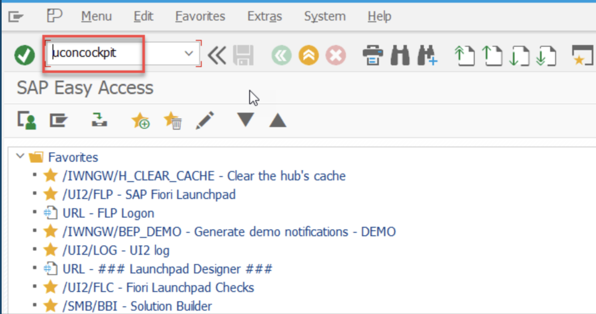

2. Activa la protección clickjacking, en la lista drop-down, selecciona HTTP Whitelist Scenario
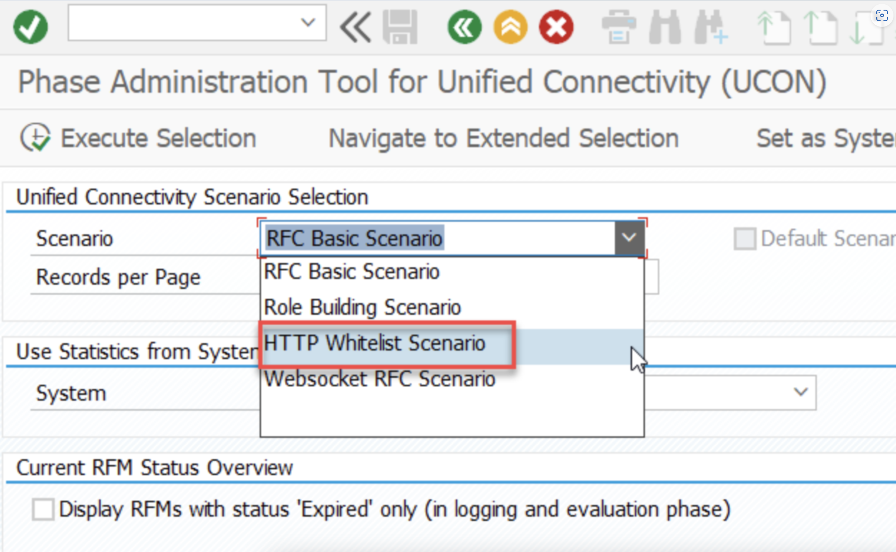

3. Si Clickjacking Framing Protection no está disponible en la lista, necesitarás activarlo. Para eso, selecciona HTTP Whitelist > Setup en el menu bar


4. En el pop-up, check en activate Clickjacking Protection (Context type 02) for all clients (recommended) y dale a continuar
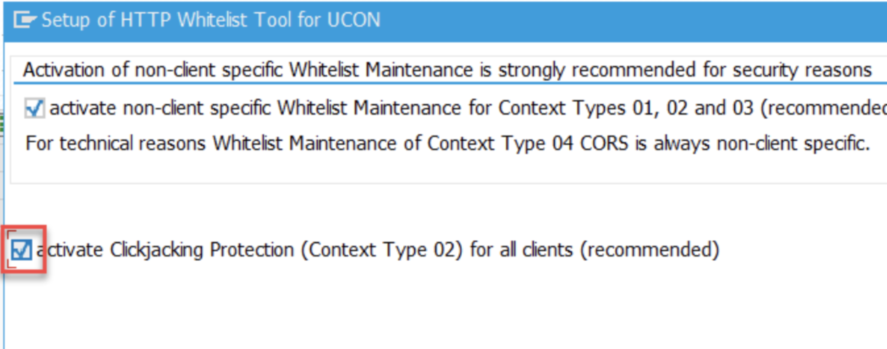
Clickjacking aquíAhora podrás ver la entrada de Clickjacking en la tabla. Ahora mismo está en modo Loggign. Esto significa que las conexiones sólo se loggean, no se validan. Con esta configuración la conectividad contra BTP va a funcionar pero, sin embargo, no es un ajuste seguro. En un entorno productivo tendrías que añadir patrones desde tu servicio SAP Launchpad y cambiar la entrada a Active check.

5. El parámetro EXPOSURE_SYSTEM_ALIASES_MODE define cómo manejar el sistema de alias durante la exposición de contenido. En mi caso el sistema era “embedded” por lo que la configuración es mucho más fácil, para más info [aquí](https://help.sap.com/docs/build-work-zone-standard-edition/sap-build-work-zone-standard-edition/manage-content-providers-on-premise?locale=en-US)
Para configurarlo puedes ejecutar /UI2/FLP_CUS_CONF o /UI2/FLP_SYS_CONF, o directamente ir por SPRO

```
⚠️ [Actualización] Si tu sistema es Gateway NO debes configurarlo.
```
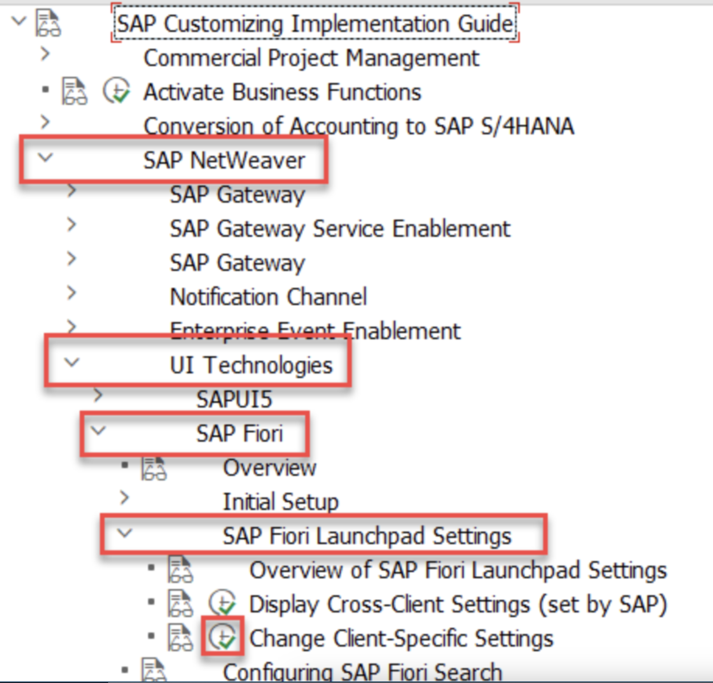

6. Añade
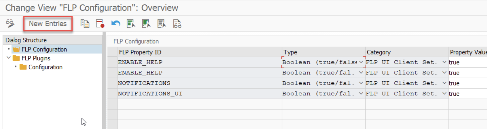

| FLP Property ID   | EXPOSURE_SYSTEM_ALIASES_MODE |
|-------------------|------------------------------|
| Type              | String type                  |
| Category          | FLP UI Server Settings       |
| Property Value    | CLEAR                        |

7. Activar el servicio cdm3 en la SICF
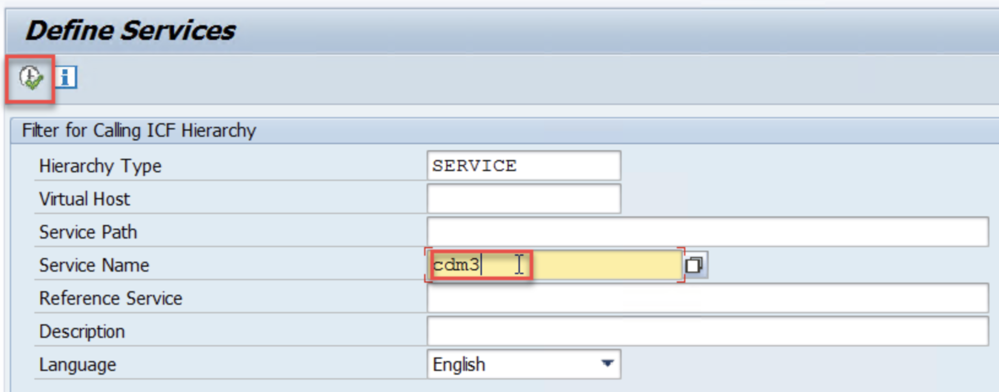

8. Click en activar servicio
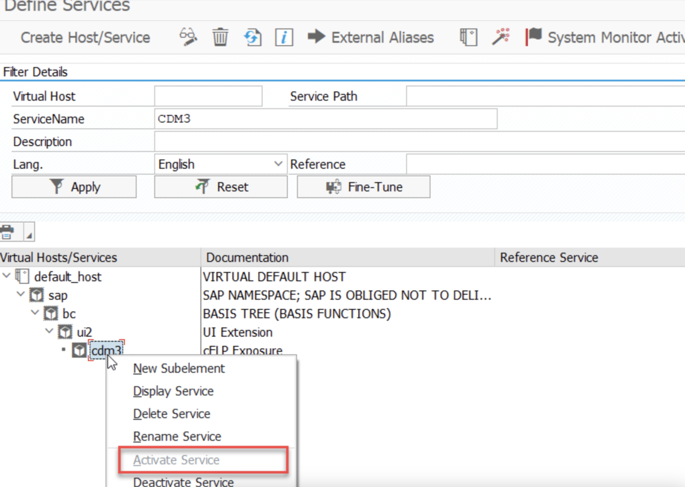

9. Accede a la transacción /UI2/CDM3_EXP_SCOPE y selecciona los roles que querrás exponer a BTP:
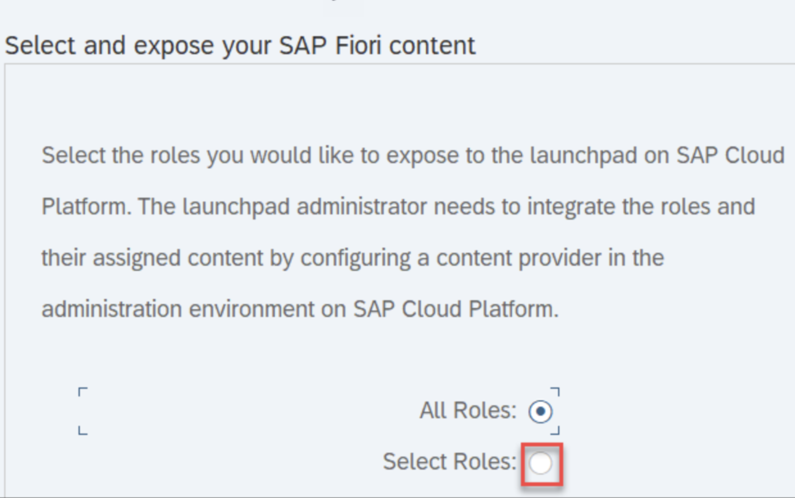
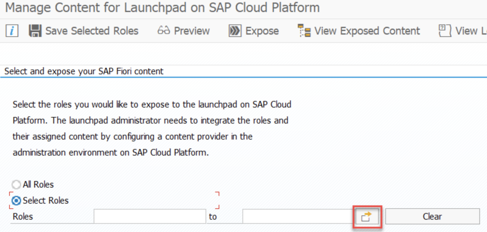

Guarda los roles que hayas seleccionado, así no tendrás que volver a seleccionarlos cuando vuelvas a exponerlos
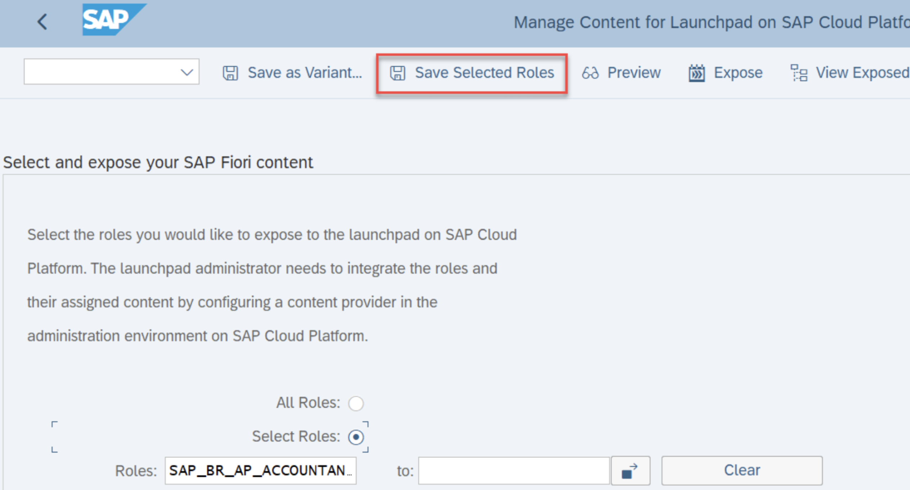
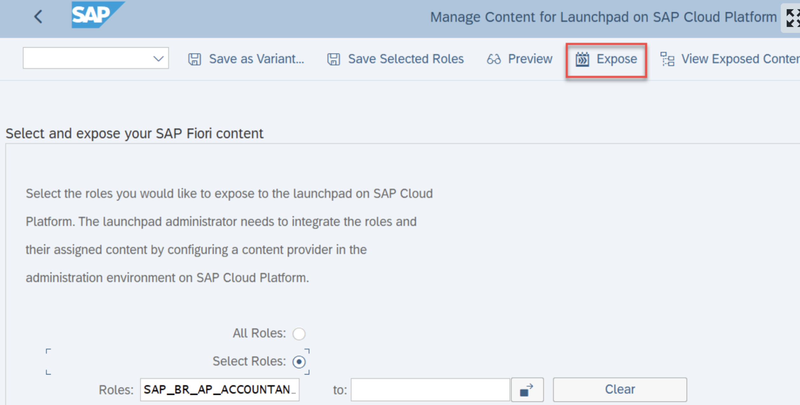

```
⚠️ Asegúrate que tu usuario de conexión (las destination que vamos a crear en BTP) el objeto de autorización /UI2/FREPO con los valores /UI2/REPO = CDM3_EXPOSURE y ACTVT = 03
```

# Configuración en BTP

1. Crea la destination design-time (que se usa para obtener el contenido federado desde el sistema content provider durante el tiempo de diseño) con esta info:
| Nombre del campo | Valor                                                      |
|------------------|------------------------------------------------------------|
| Name             | cflp-s4hana-dt                                             |
| Type             | HTTP                                                       |
| Description      | S/4 HANA Design-time destination                           |
| URL              | http://{{virtual_host}}:{{puerto}}/sap/bc/ui2/cdm3/entities|
| Proxy Type       | OnPremise                                                  |
| Authentication   | BasicAuthentication                                        |
| Location ID      | Si lo tienes rellénalo                                     |
| User             | {{tusuario}}                                               |
| Password         | {{tucontraseña}}                                           |

2. Añadir la propiedad sap-client, que es el mandante
3. Crea la destination runtime, que se usa para ejecutar las aplicaciones federadas en tiempo de ejecución
| Nombre del campo | Valor                              |
|------------------|------------------------------------|
| Name             | cflp-s4hana-rt                     |
| Type             | HTTP                               |
| Description      | S/4 HANA Runtime destination       |
| URL              | http://{{virtual_host}}:{{puerto}} |
| Proxy Type       | OnPremise                          |
| Authentication   | BasicAuthentication                |
| Location ID      | Si lo tienes rellénalo             |
| User             | {{tusuario}}                       |
| Password         | {{tucontraseña}}                   |

```
⚠️ Ojo aquí, esto es una configuración para un entorno no productivo, lo suyo es que la runtime destination esté configurada con principal propagation
```

4. En el portal de configuración del launchpad accede a Content Providers y añade uno nuevo
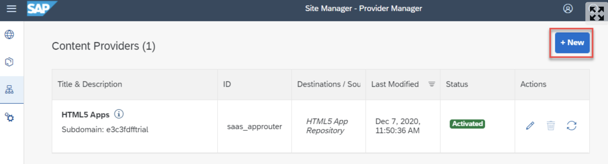

5. Rellena con la siguiente info:
| Nombre del campo              | Valor                                                       |
|-------------------------------|-------------------------------------------------------------|
| Name                          | S/4 HANA {{sysid}}.{{mandt}}                                |
| Description                   | S/4 HANA {{sysid}}.{{mandt}} content provider               |
| ID                            | Se genera solo, simplemente borra los caracteres especiales |
| Design-Time Destination       | cflp-s4hana-dt                                              |
| Runtime Destination           | cflp-s4hana-rt                                              |
| Runtime Destination for OData | Usa default                                                 |
| Content Addition Mode         | Manual addition                                             |

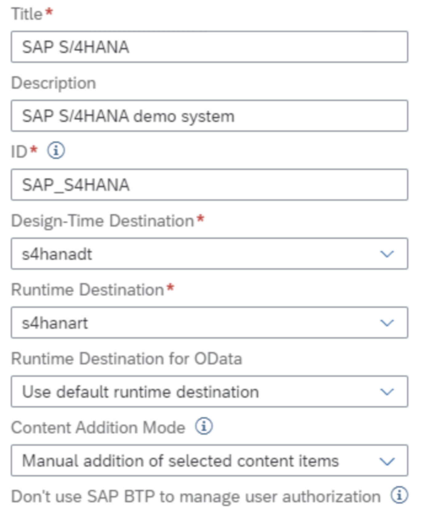

6. Espera a que se cree y ya lo tienes


```
⚠️En este punto pueden pasar 3 cosas:
– Error en la destination: que no tengas bien configuradas las destinations
– Error de autorización, tu usuario de comunicación no tiene autorizaciones para exponer las apps, por lo que te recomiendo que vayas a la su53 para ese usuario y checkees qué es lo que le falta
– Error en el cloud connector, los recursos no están correctamente expuesto o CC “no ve” el sistema S4
```

7. En el content explorer ahora te deberían aparecer el content provider de S4
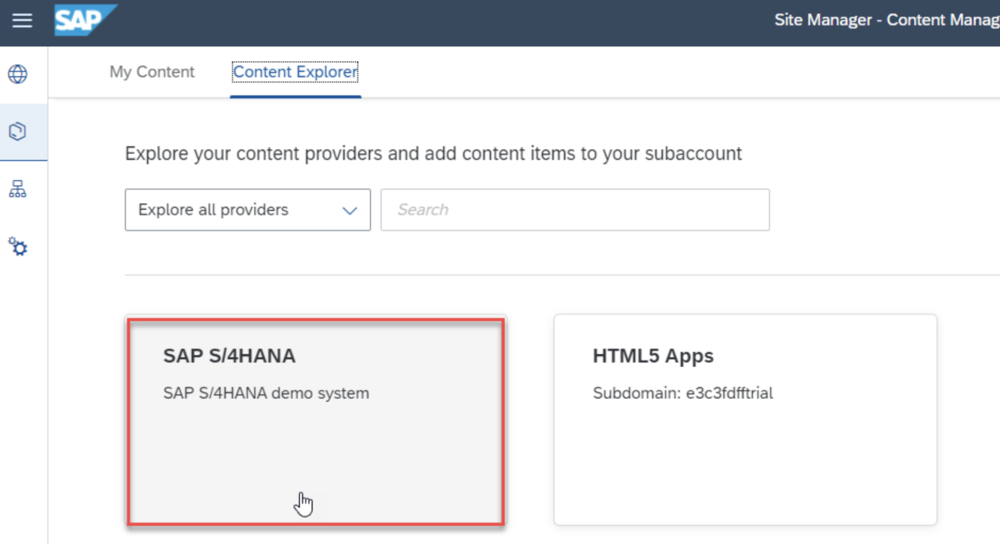

Fuentes:

[Configure Your SAP S/4HANA System for Content Federation | Tutorials for SAP Developers](https://developers.sap.com/tutorials/cp-launchpad-federation-prepares4hana.html)

[Connect Your SAP BTP Trial Account to SAP S/4HANA for Content Consumption | Tutorials for SAP Developers](https://developers.sap.com/tutorials/cp-launchpad-federation-connectivity.html)